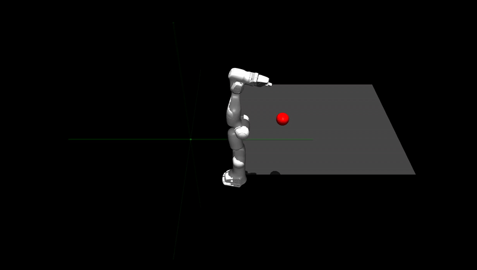
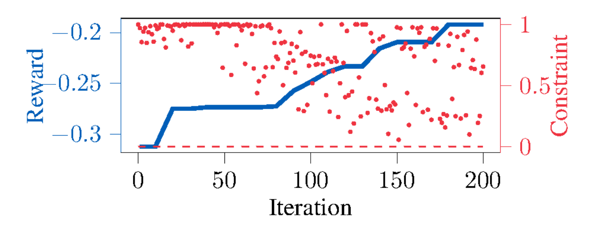

# ACC-2026
Code repository for "Safe Bayesian optimization across noise models:  A practical and unified framework." Submitted to IEEE CSS/ACC 2026.

To examine the synthetic examples, go to the branch "synthetic-example." The Franka experiments can be reproduced in the branch "Franka."

To cite this work:

@article{tokmak2025towards,
  title={Safe Bayesian optimization across noise models:  A practical and unified framework},
  author={Tokmak, Abdullah and Sch{\"o}n, Thomas B and Baumann, Dominik},
  note={Under review for IEEE CSS and ACC},
  year={2025}
}

# Franka experiment
We tune a linear quadratic regulator (LQR) using our safe BO algorithm.

## Initial policy
We start of from a safe but sub-optimal policy which tries to grab the red ball.

## Optimized policy
After 200 iterations with our safe BO algorithm, we optimize the policy to grab the red ball.

During the optimization, we have explored the domain asnd updated the GP mean for the reward and constraint functions.

Crucially, we have not conducted any experiment that violated the safety conditions, i.e., no experiment yielded a negative constraint value.

